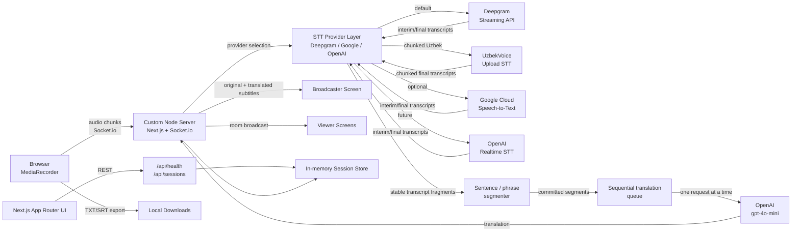

# Live Transcription Studio

Browser microphone capture, pluggable real-time STT, OpenAI translation, multi-screen live viewing, transcript history, and TXT/SRT export.

Deepgram streams English/Russian speech and OpenAI chunked STT handles Uzbek in automatic mode. A provider-independent sentence buffer commits stable phrases before OpenAI `gpt-4o-mini` translates them. If translation fails, transcription and microphone capture continue while the UI keeps the last successful subtitle visible.

## Features

- Browser microphone capture with `MediaRecorder`
- Live audio streaming over Socket.io
- Pluggable STT provider layer with Deepgram default, Google optional, and OpenAI chunked STT for Uzbek
- Deepgram streaming speech-to-text with interim and final transcripts
- Optional Google Cloud Speech-to-Text provider for source speech
- Experimental UzbekVoice chunked STT provider for Uzbek source speech
- Stable sentence/phrase buffering with punctuation, pause, duration, length, and stop-flush commits
- Sequential OpenAI `gpt-4o-mini` translation for committed segments only
- One broadcaster device streams microphone audio
- Unlimited viewer devices can join with a session code
- Viewers receive original and translated subtitles over Socket.io rooms
- Shareable session links using `?session=<code>`
- Transcript history for final segments in the current room
- Export transcript history to `.txt`
- Export subtitle history to `.srt`
- Session dashboard with status, language, viewer count, and quick join
- Real-time latency dashboard for capture, Deepgram, WebSocket, and end-to-end timing
- Uzbek, English, and Russian language selection in the UI
- Loading, connection, recording, error, and empty states
- Next.js 15 App Router, TypeScript, Tailwind CSS, Node.js, Socket.io

## Architecture



The custom `server.ts` starts Next.js and attaches Socket.io to the same HTTP server. Microphone audio and live subtitle updates use WebSockets; session creation uses ordinary App Router API routes.

## Environment Variables

Copy `.env.example` to `.env.local`:

```bash
DEEPGRAM_API_KEY=your_deepgram_api_key
OPENAI_API_KEY=your_openai_api_key
NEXT_PUBLIC_APP_URL=http://localhost:3000
PORT=3000
STT_PROVIDER=auto
STT_AUTO_FALLBACK=true
DEEPGRAM_MODEL=nova-3
DEEPGRAM_ENDPOINTING_MS=60
GOOGLE_STT_ENABLED=false
GOOGLE_APPLICATION_CREDENTIALS=
GOOGLE_STT_CREDENTIALS_JSON=
GOOGLE_STT_PROJECT_ID=
GOOGLE_STT_LOCATION=global
GOOGLE_STT_RECOGNIZER=_
GOOGLE_STT_MODEL=chirp_3
GOOGLE_STT_LANGUAGE_CODE=uz-UZ
GOOGLE_STT_INTERIM_RESULTS=true
OPENAI_STT_ENABLED=true
OPENAI_STT_MODE=chunked
OPENAI_STT_MODEL=gpt-4o-mini-transcribe
OPENAI_STT_LANGUAGE=uz
OPENAI_STT_PROMPT=The audio is in Uzbek. Transcribe the Uzbek speech accurately. Preserve Uzbek words and names.
OPENAI_STT_UPLOAD_FORMAT=wav
OPENAI_STT_SAMPLE_RATE=16000
OPENAI_STT_CHANNELS=1
OPENAI_STT_MIN_BYTES=12000
OPENAI_STT_CHUNK_MS=3000
OPENAI_STT_TIMEOUT_MS=10000
UZBEKVOICE_STT_ENABLED=false
UZBEKVOICE_API_KEY=
UZBEKVOICE_BASE_URL=https://uzbekvoice.ai
UZBEKVOICE_STT_MODE=chunked
UZBEKVOICE_STT_LANGUAGE=uz
UZBEKVOICE_STT_MODEL=general
UZBEKVOICE_STT_CHUNK_MS=3000
UZBEKVOICE_STT_BLOCKING=true
UZBEKVOICE_STT_TIMEOUT_MS=10000
TRANSLATION_SEGMENT_MODE=stable
TRANSLATION_COMMIT_ON_PUNCTUATION=true
TRANSLATION_COMMIT_SILENCE_MS=900
TRANSLATION_SEGMENT_MIN_CHARS=12
TRANSLATION_SEGMENT_MAX_CHARS=140
TRANSLATION_SEGMENT_MAX_DURATION_MS=7000
TRANSLATION_FINAL_DEBOUNCE_MS=150
INTERIM_TRANSLATION_ENABLED=false
INTERIM_TRANSLATION_MIN_CHARS=8
INTERIM_TRANSLATION_MIN_INTERVAL_MS=350
INTERIM_TRANSLATION_STABILITY_MS=400
SUBTITLE_MIN_DISPLAY_MS=1000
SUBTITLE_MAX_CHARS=120
OPENAI_TRANSLATION_TIMEOUT_MS=1800
OPENAI_TRANSLATION_MAX_TOKENS=70
RUNTIME_DEBUG_LOGS=false
```

Environment variable reference:

- `DEEPGRAM_API_KEY`: Required. Server-side Deepgram API key used for streaming transcription.
- `OPENAI_API_KEY`: Optional but recommended. Enables OpenAI translation. If missing, Deepgram transcription still works and the UI shows `OpenAI translation is not configured`.
- `NEXT_PUBLIC_APP_URL`: Required in production. Set to the public Railway or Render URL with protocol, for example `https://your-app.up.railway.app` or `https://your-app.onrender.com`. `your-app.up.railway.app` without `https://` is invalid. Comma-separated origins are supported if you need multiple allowed Socket.io origins.
- `PORT`: Local development port. Railway and Render inject this automatically in production.
- `STT_PROVIDER`: STT provider strategy: `auto`, `deepgram`, `openai`, `uzbekvoice`, or `google`. Default: `auto`.
- `STT_AUTO_FALLBACK`: If `true`, provider failures can fall back to Deepgram when possible. Default: `true`.
- `DEEPGRAM_MODEL`: Deepgram model name. Default: `nova-3`.
- `DEEPGRAM_ENDPOINTING_MS`: Deepgram endpointing value in milliseconds. Default: `60`.
- `GOOGLE_STT_ENABLED`: Enables Google Cloud Speech-to-Text provider. Default: `false`.
- `GOOGLE_APPLICATION_CREDENTIALS`: Server-side path to a Google service account JSON file. Useful locally or when your host supports secret files.
- `GOOGLE_STT_CREDENTIALS_JSON`: Full Google service account JSON stored as a Railway/Render secret env var. This is read server-side only and is never exposed or logged.
- `GOOGLE_STT_PROJECT_ID`: Google Cloud project id for Speech-to-Text.
- `GOOGLE_STT_LOCATION`: Google STT location. Default: `global`.
- `GOOGLE_STT_RECOGNIZER`: Google recognizer id for future v2 integrations. Default: `_`.
- `GOOGLE_STT_MODEL`: Google STT model. Default: `chirp_3`. If your Google API rejects this with v1 streaming, use a supported model such as `latest_long`.
- `GOOGLE_STT_LANGUAGE_CODE`: Uzbek Google language code. Default: `uz-UZ`; English and Russian map to `en-US` and `ru-RU`.
- `GOOGLE_STT_INTERIM_RESULTS`: Enables Google interim transcript results. Default: `true`.
- `OPENAI_STT_ENABLED`: Enables OpenAI STT for Uzbek auto-routing. Default: `true` in `.env.example`.
- `OPENAI_STT_MODE`: OpenAI STT mode. `chunked` is implemented. `realtime` requires a Realtime API implementation and is not sent to `/v1/audio/transcriptions`.
- `OPENAI_STT_MODEL`: OpenAI STT model name for chunked audio transcription. Default: `gpt-4o-mini-transcribe`. Valid chunked models are `gpt-4o-mini-transcribe`, `gpt-4o-transcribe`, and `whisper-1`.
- `OPENAI_STT_LANGUAGE`: OpenAI STT language hint for non-Uzbek manual OpenAI STT usage. Default: `uz`. For Uzbek source speech, this value is not sent to `/v1/audio/transcriptions` because the endpoint can reject `uz`; prompt guidance is used instead.
- `OPENAI_STT_PROMPT`: Prompt guidance for Uzbek OpenAI STT. Default: `The audio is in Uzbek. Transcribe the Uzbek speech accurately. Preserve Uzbek words and names.`
- `OPENAI_STT_UPLOAD_FORMAT`: Upload format for OpenAI chunked STT. Default: `wav`. The server converts browser WebM/Opus chunks to WAV before sending them to OpenAI.
- `OPENAI_STT_SAMPLE_RATE`: WAV sample rate for OpenAI chunked STT conversion. Default: `16000`.
- `OPENAI_STT_CHANNELS`: WAV channel count for OpenAI chunked STT conversion. Default: `1`.
- `OPENAI_STT_MIN_BYTES`: Minimum audio payload size before a chunk is sent to OpenAI. Default: `12000`; tiny or empty chunks are skipped.
- `OPENAI_STT_CHUNK_MS`: Audio chunk size for chunked OpenAI STT. Default: `3000`.
- `OPENAI_STT_TIMEOUT_MS`: Per-chunk OpenAI STT timeout. Default: `10000`.
- `UZBEKVOICE_STT_ENABLED`: Enables experimental UzbekVoice chunked STT. Default: `false`.
- `UZBEKVOICE_API_KEY`: Server-side UzbekVoice API key. Never expose this to the browser.
- `UZBEKVOICE_BASE_URL`: UzbekVoice API base URL. Default: `https://uzbekvoice.ai`.
- `UZBEKVOICE_STT_MODE`: UzbekVoice mode. Currently only `chunked` is supported.
- `UZBEKVOICE_STT_LANGUAGE`: UzbekVoice language value: `uz`, `ru`, or `uz-ru`. Default: `uz`.
- `UZBEKVOICE_STT_MODEL`: UzbekVoice model: `general` or `enhanced-stt`. Default: `general`.
- `UZBEKVOICE_STT_CHUNK_MS`: Audio chunk size sent to UzbekVoice. Default: `3000`.
- `UZBEKVOICE_STT_BLOCKING`: Uses blocking upload for short chunks. Default: `true`.
- `UZBEKVOICE_STT_TIMEOUT_MS`: Per-chunk UzbekVoice request timeout. Default: `10000`.
- `TRANSLATION_SEGMENT_MODE`: Translation timing mode. `stable` is the production default; `fast` is reserved for experimental interim behavior.
- `TRANSLATION_COMMIT_ON_PUNCTUATION`: Commits a meaningful buffered phrase when it ends in sentence punctuation. Default: `true`.
- `TRANSLATION_COMMIT_SILENCE_MS`: Transcript inactivity before a buffered phrase is committed. Default: `900`.
- `TRANSLATION_SEGMENT_MIN_CHARS`: Minimum meaningful committed phrase length. Default: `12`.
- `TRANSLATION_SEGMENT_MAX_CHARS`: Maximum target buffer length before a safe word/punctuation split. Default: `140`.
- `TRANSLATION_SEGMENT_MAX_DURATION_MS`: Maximum time speech can remain buffered before commit. Default: `7000`.
- `TRANSLATION_FINAL_DEBOUNCE_MS`: Short delay after punctuation or a Deepgram speech-final marker so adjacent final fragments can settle. Default: `150`.
- `INTERIM_TRANSLATION_ENABLED`: Reserved compatibility switch. The production stable pipeline does not issue interim translation requests. Default: `false`.
- `INTERIM_TRANSLATION_MIN_CHARS`, `INTERIM_TRANSLATION_MIN_INTERVAL_MS`, `INTERIM_TRANSLATION_STABILITY_MS`: Retained for configuration compatibility; they do not affect stable mode.
- `SUBTITLE_MIN_DISPLAY_MS`: Minimum center-subtitle display hold. Default: `1000`.
- `SUBTITLE_MAX_CHARS`: Legacy fast-mode phrase limit. Default: `120`.
- `OPENAI_TRANSLATION_TIMEOUT_MS`: OpenAI request timeout in milliseconds. Default: `1800`.
- `OPENAI_TRANSLATION_MAX_TOKENS`: Maximum tokens for streamed translations. Default: `70`.
- `RUNTIME_DEBUG_LOGS`: Set to `true` only when debugging high-frequency Deepgram/audio events in production. Default: `false`.

Do not commit real API keys or Google service account JSON files. `.env`, `.env.local`, `.env*.local`, `google-credentials*.json`, `google-service-account*.json`, `service-account*.json`, and `credentials*.json` are ignored by git.

## STT Provider Selection

- `STT_PROVIDER=deepgram`: Always use Deepgram.
- `STT_PROVIDER=google`: Always use Google STT. Requires Google env variables and credentials.
- `STT_PROVIDER=uzbekvoice`: Uses UzbekVoice experimental chunked STT. This is file-upload based, not true realtime streaming.
- `STT_PROVIDER=openai`: Uses OpenAI STT.
- `STT_PROVIDER=auto`: Uzbek uses OpenAI STT. English and Russian use Deepgram. Google and UzbekVoice are never used by auto-routing.

The broadcaster UI also includes an advanced STT provider selector. The selected provider is stored per session, and the active provider is shown as a small `STT: ...` badge on the subtitle stage.

## OpenAI Uzbek STT

Auto-routing sends Uzbek source speech to OpenAI STT. The implemented mode is chunked audio transcription:

```text
Browser audio chunks -> Socket.io -> /v1/audio/transcriptions -> transcript fragment -> sentence buffer -> translation queue
```

Use `OPENAI_STT_MODEL=gpt-4o-mini-transcribe` for this mode. Do not use `gpt-realtime-whisper` with `/v1/audio/transcriptions`; realtime models require the OpenAI Realtime transcription API/session. If a realtime model is configured in chunked mode, the app returns `OpenAI realtime STT requires Realtime API, not audio transcriptions endpoint`.

For OpenAI chunked STT, the browser records standalone short MediaRecorder files instead of 75ms streaming fragments. The server validates the chunk size, skips empty/tiny chunks, converts valid WebM/Opus input to `chunk.wav` with `ffmpeg-static`, and uploads `audio/wav` to OpenAI. This avoids intermittent `Audio file might be corrupted or unsupported` errors caused by sending arbitrary WebM fragments to a file transcription endpoint.

For Uzbek source speech, the app does not pass `language=uz` to the transcription endpoint. Some OpenAI transcription models reject the Uzbek language code and return `Language code 'uz' is not recognized`. Instead, the server sends `OPENAI_STT_PROMPT` with Uzbek-specific guidance:

```text
The audio is in Uzbek. Transcribe the Uzbek speech accurately. Preserve Uzbek words and names.
```

If OpenAI still reports a language-code error, the UI shows `OpenAI STT language code is not supported. Using prompt-based language guidance is required.`

## UzbekVoice Chunked STT

UzbekVoice's documented STT API is a file-upload endpoint, not a true WebSocket streaming API. This app supports it as an experimental chunked provider:

```text
Browser audio chunks -> Socket.io -> server buffers 2-4 seconds -> UzbekVoice multipart upload -> transcript -> OpenAI translation
```

Only one UzbekVoice request is active at a time. If speech continues while a request is in flight, the next audio buffers are queued and sent after the active request finishes. Duplicate repeated transcripts are skipped. The subtitle stage shows `STT: UzbekVoice / chunked` and a note that UzbekVoice chunked STT may be slightly delayed.

For Railway:

```env
STT_PROVIDER=auto
STT_AUTO_FALLBACK=true
UZBEKVOICE_STT_ENABLED=true
UZBEKVOICE_API_KEY=your_uzbekvoice_api_key
UZBEKVOICE_BASE_URL=https://uzbekvoice.ai
UZBEKVOICE_STT_MODE=chunked
UZBEKVOICE_STT_LANGUAGE=uz
UZBEKVOICE_STT_MODEL=general
UZBEKVOICE_STT_CHUNK_MS=3000
UZBEKVOICE_STT_BLOCKING=true
UZBEKVOICE_STT_TIMEOUT_MS=10000
```

If `UZBEKVOICE_API_KEY` is missing, the app reports `UzbekVoice STT is not configured.` and can fall back to Deepgram when `STT_AUTO_FALLBACK=true`.

## Deepgram Uzbek Test Mode

To test whether Deepgram can handle Uzbek source speech before enabling Google STT:

1. Set speaker language to **Uzbek**.
2. Set translation language to **English** or **Russian**.
3. Set STT provider to **Deepgram**.
4. Start the microphone.

If Deepgram accepts the `uz` language with the selected model, the normal flow runs:

```text
Uzbek speech -> Deepgram transcript -> OpenAI translation to English/Russian
```

The subtitle stage shows `STT: Deepgram / Uzbek test`. If Deepgram rejects the Uzbek language/model configuration, the app shows `Deepgram Uzbek STT is not supported by the selected model.` Google STT remains optional and is not required for this test.

## Google STT Setup

1. Create or select a Google Cloud project.
2. Enable Cloud Speech-to-Text API.
3. Create a service account with Speech-to-Text permissions.
4. Store the service account JSON securely. On Railway, prefer `GOOGLE_STT_CREDENTIALS_JSON` as a secret env var. If your host supports secret files, `GOOGLE_APPLICATION_CREDENTIALS` can point to the mounted JSON file instead.
5. Set:
   - `GOOGLE_STT_ENABLED=true`
   - `GOOGLE_STT_CREDENTIALS_JSON={...full service account json...}`
   - `GOOGLE_STT_PROJECT_ID=your-project-id`
   - `STT_PROVIDER=auto` or `STT_PROVIDER=google`

Never commit the service account JSON. Do not prefix it with `NEXT_PUBLIC_`; it must remain server-side only.

The app starts normally without Google configuration as long as Deepgram remains the default provider.

## Getting Started

```bash
npm install
npm run dev
```

Open [http://localhost:3000](http://localhost:3000).

## Production Deployment

This app uses a custom Node.js server in [server.ts](server.ts), which starts Next.js and attaches Socket.io to the same HTTP process. Deploy it to a platform that runs a persistent Node server process, such as Railway or Render.

Production commands:

```bash
npm run build
npm run start
```

The production start command uses `process.env.PORT`, so it works with Railway and Render's injected port.

### Railway

1. Push the repository to GitHub.
2. In Railway, create a new project from the GitHub repository.
3. Set the service type to a Node.js app.
4. Add environment variables:
   - `DEEPGRAM_API_KEY=your_deepgram_api_key`
   - `OPENAI_API_KEY=your_openai_api_key`
   - `NEXT_PUBLIC_APP_URL=https://your-service.up.railway.app`
   - `STT_PROVIDER=auto`
   - `STT_AUTO_FALLBACK=true`
   - `DEEPGRAM_MODEL=nova-3`
   - `DEEPGRAM_ENDPOINTING_MS=60`
   - `GOOGLE_STT_ENABLED=false`
   - `GOOGLE_STT_PROJECT_ID=`
   - `GOOGLE_APPLICATION_CREDENTIALS=`
   - `GOOGLE_STT_CREDENTIALS_JSON=`
   - `GOOGLE_STT_LOCATION=global`
   - `GOOGLE_STT_RECOGNIZER=_`
   - `GOOGLE_STT_MODEL=chirp_3`
   - `GOOGLE_STT_LANGUAGE_CODE=uz-UZ`
   - `GOOGLE_STT_INTERIM_RESULTS=true`
   - `OPENAI_STT_ENABLED=true`
   - `OPENAI_STT_MODE=chunked`
   - `OPENAI_STT_MODEL=gpt-4o-mini-transcribe`
   - `OPENAI_STT_LANGUAGE=uz`
   - `OPENAI_STT_PROMPT=The audio is in Uzbek. Transcribe the Uzbek speech accurately. Preserve Uzbek words and names.`
   - `OPENAI_STT_UPLOAD_FORMAT=wav`
   - `OPENAI_STT_SAMPLE_RATE=16000`
   - `OPENAI_STT_CHANNELS=1`
   - `OPENAI_STT_MIN_BYTES=12000`
   - `OPENAI_STT_CHUNK_MS=3000`
   - `OPENAI_STT_TIMEOUT_MS=10000`
   - `UZBEKVOICE_STT_ENABLED=false`
   - `UZBEKVOICE_API_KEY=`
   - `UZBEKVOICE_BASE_URL=https://uzbekvoice.ai`
   - `UZBEKVOICE_STT_MODE=chunked`
   - `UZBEKVOICE_STT_LANGUAGE=uz`
   - `UZBEKVOICE_STT_MODEL=general`
   - `UZBEKVOICE_STT_CHUNK_MS=3000`
   - `UZBEKVOICE_STT_BLOCKING=true`
   - `UZBEKVOICE_STT_TIMEOUT_MS=10000`
   - `TRANSLATION_SEGMENT_MODE=stable`
   - `TRANSLATION_COMMIT_ON_PUNCTUATION=true`
   - `TRANSLATION_COMMIT_SILENCE_MS=900`
   - `TRANSLATION_SEGMENT_MIN_CHARS=12`
   - `TRANSLATION_SEGMENT_MAX_CHARS=140`
   - `TRANSLATION_SEGMENT_MAX_DURATION_MS=7000`
   - `TRANSLATION_FINAL_DEBOUNCE_MS=150`
   - `INTERIM_TRANSLATION_ENABLED=false`
   - `INTERIM_TRANSLATION_MIN_CHARS=8`
   - `INTERIM_TRANSLATION_MIN_INTERVAL_MS=350`
   - `INTERIM_TRANSLATION_STABILITY_MS=400`
   - `SUBTITLE_MIN_DISPLAY_MS=1000`
   - `SUBTITLE_MAX_CHARS=120`
   - `OPENAI_TRANSLATION_TIMEOUT_MS=1800`
   - `OPENAI_TRANSLATION_MAX_TOKENS=70`
5. Use these Railway settings:
   - Build command: `npm run build`
   - Start command: `npm run start`
   - Port: use Railway's injected `PORT`; do not hard-code one.
6. Deploy, then update `NEXT_PUBLIC_APP_URL` to the final Railway public domain if Railway generated it after the first deploy. Include `https://`.

### Render

1. Push the repository to GitHub.
2. In Render, create a new **Web Service** from the repository.
3. Select the Node runtime.
4. Add environment variables:
   - `DEEPGRAM_API_KEY=your_deepgram_api_key`
   - `OPENAI_API_KEY=your_openai_api_key`
   - `NEXT_PUBLIC_APP_URL=https://your-service.onrender.com`
   - `STT_PROVIDER=auto`
   - `STT_AUTO_FALLBACK=true`
   - `DEEPGRAM_MODEL=nova-3`
   - `DEEPGRAM_ENDPOINTING_MS=60`
   - `GOOGLE_STT_ENABLED=false`
   - `GOOGLE_STT_PROJECT_ID=`
   - `GOOGLE_APPLICATION_CREDENTIALS=`
   - `GOOGLE_STT_CREDENTIALS_JSON=`
   - `GOOGLE_STT_LOCATION=global`
   - `GOOGLE_STT_RECOGNIZER=_`
   - `GOOGLE_STT_MODEL=chirp_3`
   - `GOOGLE_STT_LANGUAGE_CODE=uz-UZ`
   - `GOOGLE_STT_INTERIM_RESULTS=true`
   - `OPENAI_STT_ENABLED=true`
   - `OPENAI_STT_MODE=chunked`
   - `OPENAI_STT_MODEL=gpt-4o-mini-transcribe`
   - `OPENAI_STT_LANGUAGE=uz`
   - `OPENAI_STT_PROMPT=The audio is in Uzbek. Transcribe the Uzbek speech accurately. Preserve Uzbek words and names.`
   - `OPENAI_STT_UPLOAD_FORMAT=wav`
   - `OPENAI_STT_SAMPLE_RATE=16000`
   - `OPENAI_STT_CHANNELS=1`
   - `OPENAI_STT_MIN_BYTES=12000`
   - `OPENAI_STT_CHUNK_MS=3000`
   - `OPENAI_STT_TIMEOUT_MS=10000`
   - `UZBEKVOICE_STT_ENABLED=false`
   - `UZBEKVOICE_API_KEY=`
   - `UZBEKVOICE_BASE_URL=https://uzbekvoice.ai`
   - `UZBEKVOICE_STT_MODE=chunked`
   - `UZBEKVOICE_STT_LANGUAGE=uz`
   - `UZBEKVOICE_STT_MODEL=general`
   - `UZBEKVOICE_STT_CHUNK_MS=3000`
   - `UZBEKVOICE_STT_BLOCKING=true`
   - `UZBEKVOICE_STT_TIMEOUT_MS=10000`
   - `TRANSLATION_SEGMENT_MODE=stable`
   - `TRANSLATION_COMMIT_ON_PUNCTUATION=true`
   - `TRANSLATION_COMMIT_SILENCE_MS=900`
   - `TRANSLATION_SEGMENT_MIN_CHARS=12`
   - `TRANSLATION_SEGMENT_MAX_CHARS=140`
   - `TRANSLATION_SEGMENT_MAX_DURATION_MS=7000`
   - `TRANSLATION_FINAL_DEBOUNCE_MS=150`
   - `INTERIM_TRANSLATION_ENABLED=false`
   - `INTERIM_TRANSLATION_MIN_CHARS=8`
   - `INTERIM_TRANSLATION_MIN_INTERVAL_MS=350`
   - `INTERIM_TRANSLATION_STABILITY_MS=400`
   - `SUBTITLE_MIN_DISPLAY_MS=1000`
   - `SUBTITLE_MAX_CHARS=120`
   - `OPENAI_TRANSLATION_TIMEOUT_MS=1800`
   - `OPENAI_TRANSLATION_MAX_TOKENS=70`
5. Use these Render settings:
   - Build command: `npm install && npm run build`
   - Start command: `npm run start`
   - Auto-deploy: optional
   - Health check path: `/api/health`
6. Deploy, then update `NEXT_PUBLIC_APP_URL` to the final Render public URL if needed.

### Socket.io Production Notes

- Server Socket.io CORS uses `NEXT_PUBLIC_APP_URL` plus local development origins.
- `NEXT_PUBLIC_APP_URL` supports comma-separated origins for custom domains, for example `https://app.example.com,https://your-service.onrender.com`.
- Server and browser clients allow `["websocket", "polling"]` transports for proxy reliability.
- Reconnects are configured for long-running live sessions.

### Why Not Netlify

Netlify is not recommended for this version because the app depends on a persistent custom Node.js server with Socket.io rooms and live microphone audio streaming. Netlify's standard model is optimized for static sites, serverless functions, and edge functions, not long-lived WebSocket session state in a single Node process. Railway and Render are a better fit for this architecture.

## Usage

### Broadcaster

1. Enter a session title.
2. Choose the speaker language.
3. Choose the STT provider, or keep **Auto**.
4. Create a session.
5. Share the generated session code or copied link with viewers.
6. Click **Start microphone**.
7. Approve browser microphone access.
8. Speak and watch STT transcripts and OpenAI translations update live.
9. Use **Export TXT** or **Export SRT** to download the current history.
10. Click **Stop recording** when finished.

### Viewer

1. Open the app on another device.
2. Select **Viewer**.
3. Enter the broadcaster session code, or open the copied session link.
4. Watch transcript subtitles live.
5. Export the visible transcript history if needed.

## API Routes

### `GET /api/health`

Returns service health and timestamp.

### `GET /api/sessions`

Lists in-memory transcription sessions for the dashboard.

### `POST /api/sessions`

Creates a transcription session.

```json
{
  "title": "Interview transcript",
  "sourceLanguage": "en"
}
```

### `GET /api/sessions/:sessionId`

Returns session metadata and recent final transcript segments.

## Stable Live Translation Pipeline

- Browser audio is sent in 75 ms chunks.
- Socket.io uses WebSocket with polling fallback and per-message compression disabled.
- Deepgram model and endpointing are configurable; defaults are `DEEPGRAM_MODEL=nova-3` and `DEEPGRAM_ENDPOINTING_MS=60`.
- Deepgram interim results are available for live listening state but are not sent to OpenAI in stable mode.
- Deepgram final fragments and OpenAI chunked STT results enter the same provider-independent transcript buffer.
- Common word overlap and repeated chunk transcripts are deduplicated before buffering.
- Segments commit on punctuation, Deepgram speech-final, 900 ms transcript silence, 7 seconds, 140 characters, or an explicit stop flush.
- Only committed segments enter a bounded FIFO translation queue, with one OpenAI request active per session.
- Temporary timeout/5xx translation failures retry once; permanent failures remain non-blocking and the next queued segment continues.
- The center subtitle keeps the last successful translation visible while speech is buffered or a newer translation is pending.
- Only successfully translated committed segments are stored, replayed to viewers, and included in TXT/SRT exports.
- Stopping the microphone waits for the final browser audio blob to be sent, flushes meaningful buffered text, and does not cancel queued translation work.
- STT chunk or OpenAI translation errors do not stop the microphone stream.

Stable mode intentionally trades a small amount of delay for sentence context and readable subtitles. Uzbek OpenAI chunked STT also includes the configured audio-chunk duration before transcription begins.

## Latency Dashboard

The live dashboard tracks rolling averages, latest samples, and p95 values for:

- Speech capture latency: estimated browser capture time to server audio receipt.
- Deepgram latency: server audio receipt to transcript event.
- WebSocket delivery latency: server subtitle emit to client receipt.
- Total end-to-end latency: estimated capture time to client subtitle receipt.

## Multi-Screen Support

- `POST /api/sessions` creates a short uppercase session code and an opaque broadcaster reconnect token.
- The broadcaster socket registers with `session:host` and joins `session:<code>`.
- Viewer sockets register with `session:join`, receive their own opaque reconnect token, and join the same Socket.io room.
- Every `transcript:update` is emitted to the room, so all screens receive subtitles at the same time.
- New viewers receive recent final subtitle history immediately after joining.
- Viewer count is tracked in memory and broadcast with `session:updated`.
- Session codes are case-insensitive for joining.
- Viewer count is not capped in application code; practical limits are determined by the Node process, Socket.io adapter, reverse proxy, and host resources.

## Production Notes

- Use HTTPS in production. Browser microphone APIs require secure origins outside `localhost`.
- Keep Deepgram API keys server-side only.
- Configure reverse proxy WebSocket upgrades for `/socket.io`.
- The current session store is in memory. Use Redis or another shared store before running multiple Node instances.
- Deepgram language/model support can vary by account and model.

## Validation

```bash
npm test
npm run typecheck
npm run lint
npm run build
```
