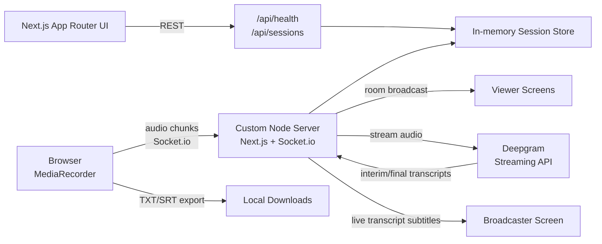

# Live Transcription Studio

Browser microphone capture, Deepgram real-time transcription, multi-screen live viewing, transcript history, session dashboard, and TXT/SRT export.

OpenAI translation is intentionally disabled in the current build. Session creation and microphone recording require only a valid Deepgram API key.

## Features

- Browser microphone capture with `MediaRecorder`
- Live audio streaming over Socket.io
- Deepgram streaming speech-to-text with interim and final transcripts
- One broadcaster device streams microphone audio
- Unlimited viewer devices can join with a session code
- Viewers receive transcript subtitles instantly over Socket.io rooms
- Shareable session links using `?session=<code>`
- Transcript history for final segments in the current room
- Export transcript history to `.txt`
- Export subtitle history to `.srt`
- Session dashboard with status, language, viewer count, and quick join
- Real-time latency dashboard for capture, Deepgram, WebSocket, and end-to-end timing
- Uzbek, English, and Russian language selection in the UI
- Loading, connection, recording, error, and empty states
- Next.js 15 App Router, TypeScript, Tailwind CSS, Node.js, Socket.io

## Architecture



The custom `server.ts` starts Next.js and attaches Socket.io to the same HTTP server. Microphone audio and live subtitle updates use WebSockets; session creation uses ordinary App Router API routes.

## Environment Variables

Copy `.env.example` to `.env.local`:

```bash
DEEPGRAM_API_KEY=your_deepgram_api_key
OPENAI_API_KEY=
NEXT_PUBLIC_APP_URL=http://localhost:3000
PORT=3000
DEEPGRAM_MODEL=nova-3
DEEPGRAM_ENDPOINTING_MS=60
OPENAI_TRANSLATION_TIMEOUT_MS=1800
OPENAI_TRANSLATION_MAX_TOKENS=70
```

Environment variable reference:

- `DEEPGRAM_API_KEY`: Required. Server-side Deepgram API key used for streaming transcription.
- `OPENAI_API_KEY`: Optional in the current build because OpenAI translation is disabled. Keep unset unless translation is re-enabled.
- `NEXT_PUBLIC_APP_URL`: Required in production. Set to the public Railway or Render URL with protocol, for example `https://your-app.up.railway.app` or `https://your-app.onrender.com`. `your-app.up.railway.app` without `https://` is invalid. Comma-separated origins are supported if you need multiple allowed Socket.io origins.
- `PORT`: Local development port. Railway and Render inject this automatically in production.
- `DEEPGRAM_MODEL`: Deepgram model name. Default: `nova-3`.
- `DEEPGRAM_ENDPOINTING_MS`: Deepgram endpointing value in milliseconds. Default: `60`.
- `OPENAI_TRANSLATION_TIMEOUT_MS`: Ignored while translation is disabled. Keep default `1800` for future translation work.
- `OPENAI_TRANSLATION_MAX_TOKENS`: Ignored while translation is disabled. Keep default `70` for future translation work.

Do not commit real API keys. `.env`, `.env.local`, and `.env*.local` are ignored by git.

## Getting Started

```bash
npm install
npm run dev
```

Open [http://localhost:3000](http://localhost:3000).

## Production Deployment

This app uses a custom Node.js server in [server.ts](server.ts), which starts Next.js and attaches Socket.io to the same HTTP process. Deploy it to a platform that runs a persistent Node server process, such as Railway or Render.

Production commands:

```bash
npm run build
npm run start
```

The production start command uses `process.env.PORT`, so it works with Railway and Render's injected port.

### Railway

1. Push the repository to GitHub.
2. In Railway, create a new project from the GitHub repository.
3. Set the service type to a Node.js app.
4. Add environment variables:
   - `DEEPGRAM_API_KEY=your_deepgram_api_key`
   - `OPENAI_API_KEY=` optional, leave empty while translation is disabled
   - `NEXT_PUBLIC_APP_URL=https://your-service.up.railway.app`
   - `DEEPGRAM_MODEL=nova-3`
   - `DEEPGRAM_ENDPOINTING_MS=60`
   - `OPENAI_TRANSLATION_TIMEOUT_MS=1800`
   - `OPENAI_TRANSLATION_MAX_TOKENS=70`
5. Use these Railway settings:
   - Build command: `npm run build`
   - Start command: `npm run start`
   - Port: use Railway's injected `PORT`; do not hard-code one.
6. Deploy, then update `NEXT_PUBLIC_APP_URL` to the final Railway public domain if Railway generated it after the first deploy. Include `https://`.

### Render

1. Push the repository to GitHub.
2. In Render, create a new **Web Service** from the repository.
3. Select the Node runtime.
4. Add environment variables:
   - `DEEPGRAM_API_KEY=your_deepgram_api_key`
   - `OPENAI_API_KEY=` optional, leave empty while translation is disabled
   - `NEXT_PUBLIC_APP_URL=https://your-service.onrender.com`
   - `DEEPGRAM_MODEL=nova-3`
   - `DEEPGRAM_ENDPOINTING_MS=60`
   - `OPENAI_TRANSLATION_TIMEOUT_MS=1800`
   - `OPENAI_TRANSLATION_MAX_TOKENS=70`
5. Use these Render settings:
   - Build command: `npm install && npm run build`
   - Start command: `npm run start`
   - Auto-deploy: optional
   - Health check path: `/api/health`
6. Deploy, then update `NEXT_PUBLIC_APP_URL` to the final Render public URL if needed.

### Socket.io Production Notes

- Server Socket.io CORS uses `NEXT_PUBLIC_APP_URL` plus local development origins.
- `NEXT_PUBLIC_APP_URL` supports comma-separated origins for custom domains, for example `https://app.example.com,https://your-service.onrender.com`.
- Server and browser clients allow `["websocket", "polling"]` transports for proxy reliability.
- Reconnects are configured for long-running live sessions.

### Why Not Netlify

Netlify is not recommended for this version because the app depends on a persistent custom Node.js server with Socket.io rooms and live microphone audio streaming. Netlify's standard model is optimized for static sites, serverless functions, and edge functions, not long-lived WebSocket session state in a single Node process. Railway and Render are a better fit for this architecture.

## Usage

### Broadcaster

1. Enter a session title.
2. Choose the speaker language.
3. Create a session.
4. Share the generated session code or copied link with viewers.
5. Click **Start microphone**.
6. Approve browser microphone access.
7. Speak and watch Deepgram transcripts update live.
8. Use **Export TXT** or **Export SRT** to download the current history.
9. Click **Stop recording** when finished.

### Viewer

1. Open the app on another device.
2. Select **Viewer**.
3. Enter the broadcaster session code, or open the copied session link.
4. Watch transcript subtitles live.
5. Export the visible transcript history if needed.

## API Routes

### `GET /api/health`

Returns service health and timestamp.

### `GET /api/sessions`

Lists in-memory transcription sessions for the dashboard.

### `POST /api/sessions`

Creates a transcription session.

```json
{
  "title": "Interview transcript",
  "sourceLanguage": "en"
}
```

### `GET /api/sessions/:sessionId`

Returns session metadata and recent final transcript segments.

## Low-Latency Transcription

- Browser audio is sent in 75 ms chunks.
- Socket.io is locked to WebSocket transport with per-message compression disabled.
- Deepgram model and endpointing are configurable; defaults are `DEEPGRAM_MODEL=nova-3` and `DEEPGRAM_ENDPOINTING_MS=60`.
- Interim Deepgram transcripts are displayed immediately.
- Final transcripts are stored in session history and replayed to new viewers.

The sub-second target depends on microphone/browser scheduling, network distance to Deepgram, language/model availability, and hosting location.

## Latency Dashboard

The live dashboard tracks rolling averages, latest samples, and p95 values for:

- Speech capture latency: estimated browser capture time to server audio receipt.
- Deepgram latency: server audio receipt to transcript event.
- WebSocket delivery latency: server subtitle emit to client receipt.
- Total end-to-end latency: estimated capture time to client subtitle receipt.

## Multi-Screen Support

- `POST /api/sessions` creates a short uppercase session code and an opaque broadcaster reconnect token.
- The broadcaster socket registers with `session:host` and joins `session:<code>`.
- Viewer sockets register with `session:join`, receive their own opaque reconnect token, and join the same Socket.io room.
- Every `transcript:update` is emitted to the room, so all screens receive subtitles at the same time.
- New viewers receive recent final subtitle history immediately after joining.
- Viewer count is tracked in memory and broadcast with `session:updated`.
- Session codes are case-insensitive for joining.
- Viewer count is not capped in application code; practical limits are determined by the Node process, Socket.io adapter, reverse proxy, and host resources.

## Production Notes

- Use HTTPS in production. Browser microphone APIs require secure origins outside `localhost`.
- Keep Deepgram API keys server-side only.
- Configure reverse proxy WebSocket upgrades for `/socket.io`.
- The current session store is in memory. Use Redis or another shared store before running multiple Node instances.
- Deepgram language/model support can vary by account and model.

## Validation

```bash
npm run typecheck
npm run lint
npm run build
```
